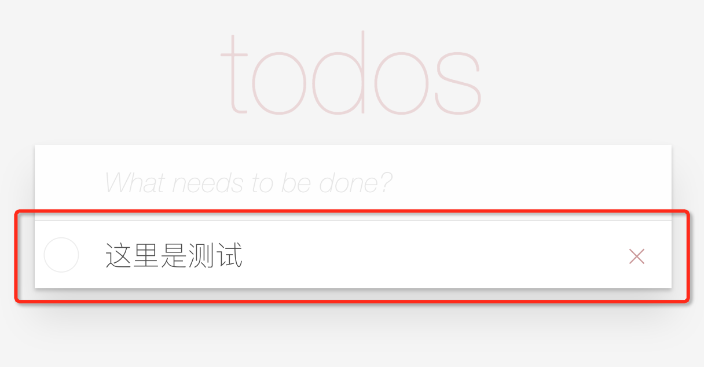
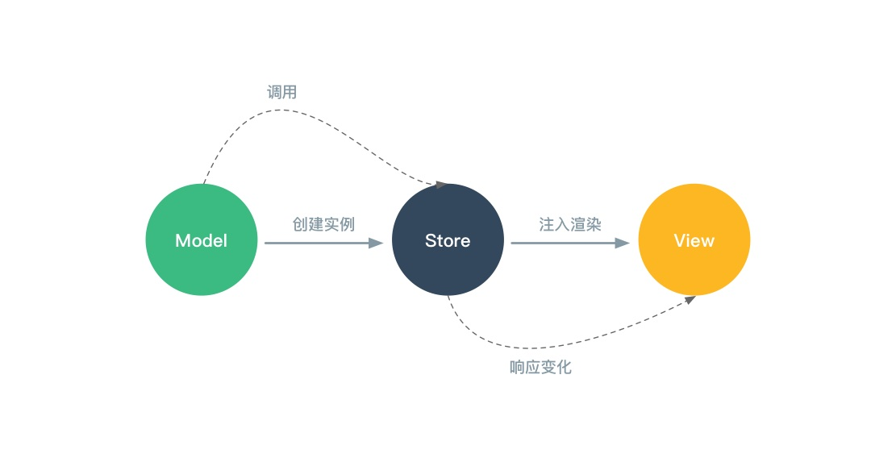

# 利用Dawn工程化工具脚手架实践MobX数据流管理方案

项目在最初应用 MobX 时，对较为复杂的多人协作项目的数据流管理方案没有一个优雅的解决方案，通过对[官方文档](https://mobx.js.org/best/store.html)中针对大型可维护项目最佳实践的学习和应用，把自己的理解抽象出一个简单的todoMVC应用，供大家交流和讨论。

## 搭建开发环境

### 安装Dawn

> 要求 Node.js v7.6.0 及以上版本。

```bash
$ [sudo] npm install dawn -g
```

### 初始化工程

```bash
$ dawn init -t front
```
这里我选择使用无依赖的 front 模板，便于自定义我的前端工程。

### 目录结构分析
由 dawn 工具生成的项目目录如下：

```
.
├── .dawn # dawn 配置文件
├── node_modules
├── src
│   ├── assets
│   └── index.js
├── test # 单元测试
├── .eslintrc.json
├── .eslintrc.yml
├── .gitignore
├── .npmignore
├── README.md
├── package.json
├── server.yml
└── tsconfig.json
```

其中我们重点需要关注的是 src 目录，其中的 index.js 就是我们项目的入口文件。

### 安装依赖

```js
"devDependencies": {
  "react": "^15.6.1",
  "react-dom": "^15.6.1"
},
"dependencies": {
  "mobx": "^3.2.2",
  "mobx-react": "^4.2.2",
  // 以下是todoMVC样式模块
  "todomvc-app-css": "^2.1.0",
  "todomvc-common": "^1.0.4"
}
```
安装好依赖，环境就配置完成了，整个环境搭建过程只需要3步，开箱即用，不需要关注 Webpack 和 ESLint 等开发环境的繁琐配置。当然，Dawn 也完全支持自定义这些工具的配置。

## todoMVC with MobX

新的项目目录设计如下：

```
...
├── src
│   ├── assets # 放置静态文件
│   │   ├── common.less
│   │   ├── favicon.ico
│   │   └── index.html
│   ├── components # 业务组件
│   │   ├── todoApp.js
│   │   ├── todoEntry.js
│   │   ├── todoItem.js
│   │   └── todoList.js
│   ├── index.js # 入口文件
│   ├── models # 数据模型定义
│   │   └── TodoModel.js
│   ├── stores # 数据store定义
│   │   ├── TodoStore.js
│   │   ├── ViewStore.js
│   │   └── index.js
│   └── utils # 工具函数
│       └── index.js
...
```

其中 MobX 数据流实践的核心概念就是数据模型(Model)和数据储存(Store)。

### 定义数据模型

数据模型即为 MVVM(Model/View/ViewModel) 中的 Model。早期的前端开发，需求比较简单，大多是基于后端传输的数据去直接填充页面中的“坑位”，没有定义数据模型的意识。但随着前端业务复杂度和数据传输量的不断上升，如果没有数据模型的定义，在多人协作时会让前端系统维护的复杂性和不可控性急剧上升，直观体现就是其它人对数据做改动时，很难覆盖到改动的某个字段会产生的全部影响，直接导致维护的周期和难度不断增加。

定义数据模型有以下好处：
- 让数据源变的可控，可以清晰的了解到定义字段的含义、类型等信息，是数据的天然文档，对多人协作大有裨益。通过应用面向对象的思想，也可以在模型中定义一些属性和方法供创建出的实例使用。
- 实现前端数据持久化，单页应用经常会遇到多页面数据共享和实时更新的问题，通过定义数据模型并创建实例，可以避免异步拉取来的数据进行 View 层渲染后就被销毁。

下面是待办事项的数据模型定义：



```js
import { observable } from 'mobx';
class TodoModel {
  store;
  id;
  @observable title;
  @observable completed;
  /**
   * 创建一个TodoModel实例
   * 用于单个todo列表项的操作
   * @param {object} store 传入TodoStore，获取领域模型状态和方法
   * @param {string} id 用于前端操作的实例id
   * @param {string} title todo项的内容
   * @param {boolean} completed 是否完成的状态
   * @memberof TodoModel
   */
  constructor(store, id, title, completed) {
    this.store = store;
    this.id = id;
    this.title = title;
    this.completed = completed;
  }
  // 切换列表项的完成状态
  toggle = () => {
    this.completed = !this.completed;
  }
  // 根据id删除列表项
  delete = () => {
    this.store.todos = this.store.todos
      .filter(todo => todo.id !== this.id);
  }
  // 设置实例title
  setTitle = (title) => {
    this.title = title;
  }
}
export default TodoModel;
```

从 TodoModel 的定义中可以清楚的看到一个待办事项拥有的属性和方法，通过这些，就可以对创建出的实例进行相应的操作。但是在实例中只能修改实例自身的属性，怎样才能把待办事项的状态变化通过 viewModel 来渲染到 view 层呢？

### 定义数据储存

官方文档对数据储存的定义是这样的：
> Stores can be found in any Flux architecture and can be compared a bit with controllers in the MVC pattern. The main responsibility of stores is to move logic and state out of your components into a standalone testable unit.

翻译过来是：数据储存(Store)可以在任何 Flux 系架构中找到，可以与 MVC 模式中的控制器(Controller)进行类比。它的主要职责是将逻辑和状态从组件中移至一个独立的，可测试的单元。

也就是说，Store 就是连接我们的 View 层和 Model 层之间的桥梁，即 ViewModel，所有的状态和逻辑变化都应该在 Store 中完成。同一个 Store 不应该在内存中有多个实例，要确保每个 Store 只有一个实例，并允许我们安全地对其进行引用。

下面通过项目示例来更清晰的理解这个过程。

首先是 todoMVC 的数据 Store 定义：

```js
import { observable } from 'mobx';
import { uuid } from '../utils';
import TodoModel from '../models/TodoModel';
class TodoStore {
  // 保存todo列表项
  @observable todos = [];
  // 添加todo，参数为todo内容
  // 注意：此处传入的 this 即为 todoStore 实例的引用
  // 通过引用使得 TodoModel 有了调用 todoStore 的能力
  addTodo(title) {
    this.todos.push(
      new TodoModel(this, uuid(), title, false)
    );
  }
}
export default TodoStore;
```

需要注意的是，在创建 TodoModel 传入的 this 即为 todoStore 实例的引用，通过这里的引用使得 TodoModel 的实例拥有了调用 todoStore 的能力，这也就是我们要保证数据储存的 Store 只有一个实例的原因。

然后是视图层对数据进行渲染的方式：

```js
import React, { Component } from 'react';
import { computed } from 'mobx';
import { inject, observer } from 'mobx-react';
import TodoItem from './todoItem';
@inject('todoStore')
@observer
class TodoList extends Component {
  @computed get todoStore() {
    return this.props.todoStore;
  }
  render() {
    const { todos } = this.todoStore;
    return (
      <section className="main">
        <ul className="todo-list">
          {todos.map(todo => <TodoItem key={todo.id} todo={todo} />)}
        </ul>
      </section>
    );
  }
}
export default TodoList;
```

我们把这个过程分步来理解：
- 首先，拿到待办事项的内容(title)和完成状态，通过 TodoModel 创建一个新的待办事项的实例。
- 其次，在 todoStore 中把每个创建出的 TodoModel 实例填入 todos 数组，用于待办事项列表的渲染。
- 最后，在视图层中通过 inject 装饰器注入todoStore，从而引用其中的 todos 数组，MobX 会响应数组的变化完成渲染。

如果待办事项的内容和完成状态需要改动，就要修改 Model 中对应的类型属性，然后在 todoStore 中进行相应的加工，最后产出新的视图展示。而在这个过程中，我们只需要把可能会变化的属性定义为可观察的变量，在需要变更的时候进行修改，剩余的工作 MobX 会帮我们完成。

### 定义用户界面状态

刚才定义的 todoStore 是针对数据储存的，但是对于前端来讲，还有很大一部分工作是 UI 的状态管理。
UI 的状态通常没有太多的逻辑，但会包含大量松散耦合的状态信息，同样可以通过定义 UI Store 来管理这部分状态。

以下是一个 UI Store 的简单定义：

```js
import { observable } from 'mobx';
export default class ViewStore {
  @observable todoBeingEdited = null;
}
```

这个 Store 只包含一个可观察的属性，用于保存正在编辑的 TodoModal 实例，通过这个属性来控制视图层待办事项的修改：

```js
...
class TodoItem extends Component {

  ...

  edit = () => {
    // 设置 todoBeingEdited 为当前待办事项todo的实例
    this.viewStore.todoBeingEdited = this.todo;
    this.editText = this.todo.title;
  };

  ...

  handleSubmit = () => {
    const val = this.editText.trim();
    if (val) {
      this.todo.setTitle(val);
      this.editText = val;
    } else {
      this.todo.delete();
    }
    // 提交修改后初始化 todoBeingEdited 变量
    this.viewStore.todoBeingEdited = null;
  }

  render() {
    // 根据 todoBeingEdited 和当前 todo 比较的结果判断是否处于编辑状态
    const isEdit = expr(() => 
      this.viewStore.todoBeingEdited === this.todo);
    const cls = [
      this.todo.completed ? 'completed' : '',
      isEdit ? 'editing' : ''
    ].join(' ');
    return (
      <li className={cls}>
        ...
      </li>
    );
  }

}

export default TodoItem;
```

在视图中对 UI Store 的可观察的属性进行修改，MobX 会收集相应的变化经过处理后响应在视图上。

## 源码

完整的 todoMVC 代码可以通过以下方式获取：

```bash
$ dawn init -t react-mobx
```
或者在 Github 上查看源码：https://github.com/xdlrt/dn-template-react-mobx

## 总结

基于 MobX 的数据流管理方案，分为以下几步：

- 定义数据 Model，使数据源可控并可持久化
- 定义数据 Store 和 UI Store，创建并管理数据 Model 实例及实例属性的变更
- 将 Store 注入到视图层，使用其中的数据进行视图渲染，MobX 自动响应数据的变化更新视图



以上是我对 MVVM 框架中使用 MobX 管理数据流的一些理解，同时这种方案也在团队内一个较为复杂的项目中进行实践，目前项目的健壮性和可维护性比较健康，欢迎提出不同的见解，共同交流。

## 最后再吃我一发安利
Dawn 是「阿里云-业务运营事业部」前端团队开源的前端构建和工程化工具。

它通过封装中间件(middleware) ，如 webpack 和本地 server ，并在项目 pipeline 中按需使用，可以将开发过程抽象为相对固定的阶段和有限的操作，简化并**统一**开发环境，能够极大地提高团队的开发效率。

项目的模板即工程 boilerplate 也可以根据团队的需要进行定制复用，实现「configure once run everywhere」。
欢迎体验并提出意见和建议，帮助我们改进。Github地址：https://github.com/alibaba/dawn 